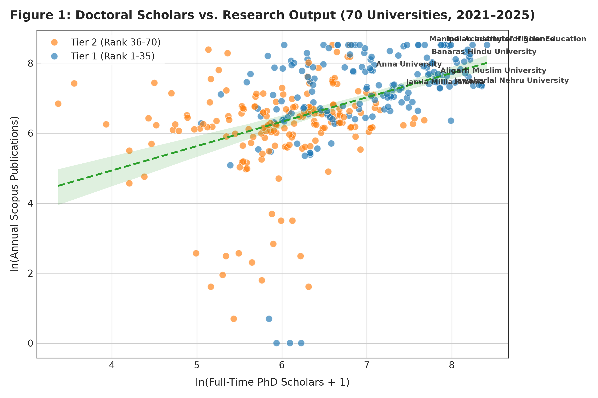
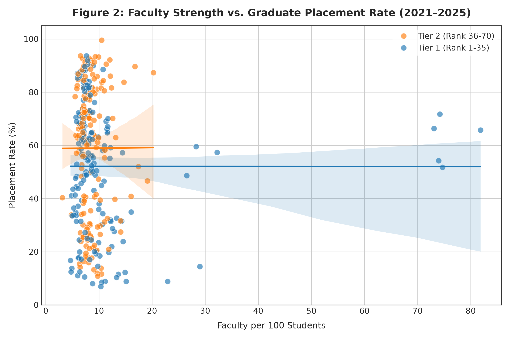
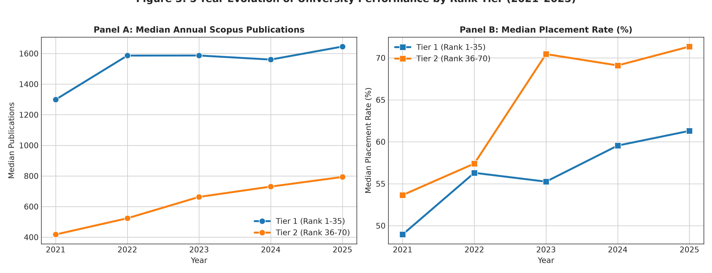
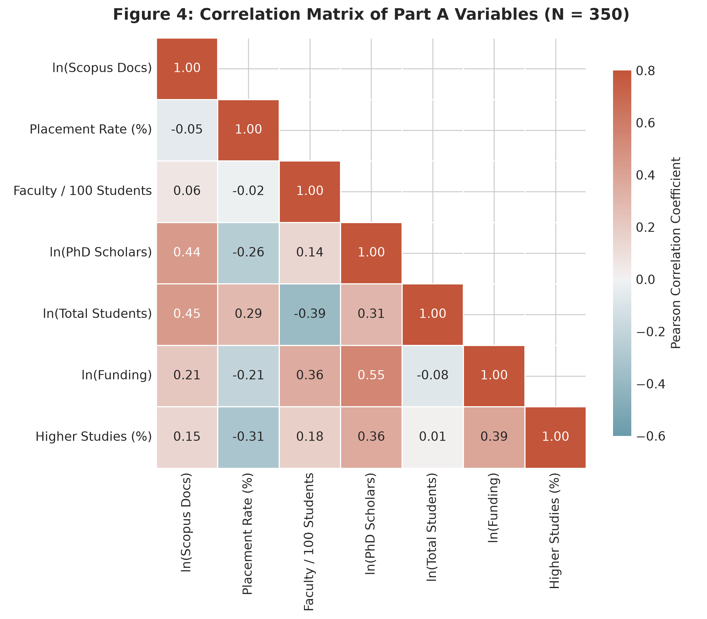
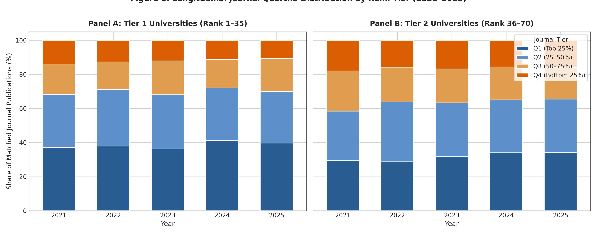
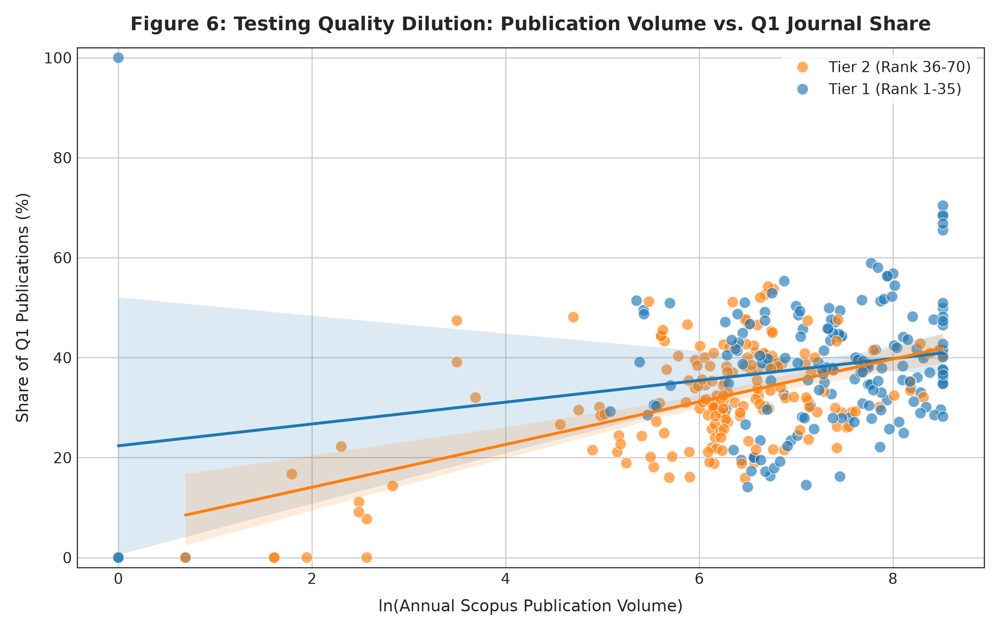
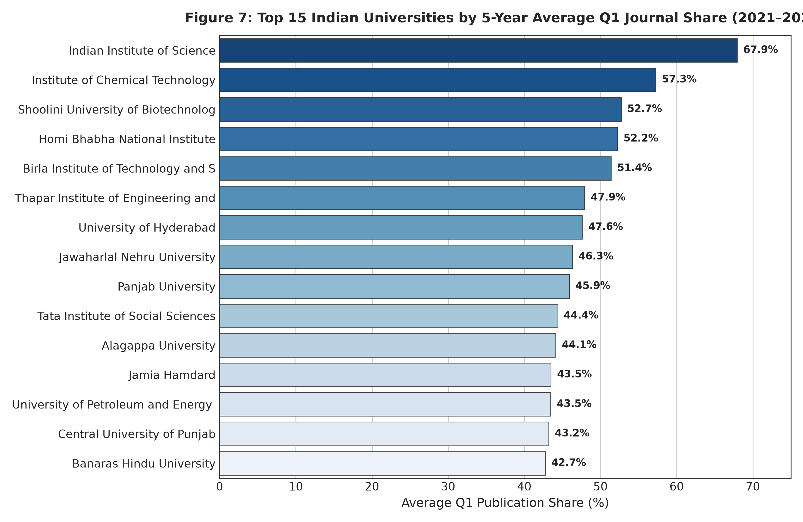

# Evaluating the Impact of NIRF on University Research and Quality: An Empirical Panel Study of 70 Indian Universities (2021–2025)

**Authors / Research Project**: NIRF Research Study (Part A & Part B)  
**Codebase & Data**: `github.com/rdnk2004/nirf-research`  
**Panel Specification**: Balanced Panel (*N* = 70 Universities × *T* = 5 Years [2021–2025] = 350 Observations)  
**Primary Data Sources**: Raw Institutional NIRF PDF Submissions, Scopus Search API, SCImago Journal & Country Rank Annual Snapshots  

---

## Table of Contents

1. [Executive Summary](#executive-summary)
2. [Background & Research Framework](#1-background--research-framework)
3. [Dataset Construction & Panel Scope](#2-dataset-construction--panel-scope)
4. [Part A: Teaching-Learning Resources vs. Real Institutional Outputs](#3-part-a-teaching-learning-resources-vs-real-institutional-outputs)
5. [Part B: Journal Quality & Gaming Channel Analysis](#4-part-b-journal-quality--gaming-channel-analysis)
6. [Novel Pattern Discoveries & Discussion for the Paper](#5-novel-pattern-discoveries--discussion-for-the-paper)
7. [Visualizations & Figures Index](#6-visualizations--figures-index)
8. [Policy Implications & Conclusion](#7-policy-implications--conclusion)

---

## Executive Summary

This study provides an empirical evaluation of India's National Institutional Ranking Framework (NIRF) and its impact on university research productivity, publication quality, and student career outcomes across a 5-year balanced panel of 70 top-ranked Indian universities (2021–2025). 

Addressing the core methodological limitation of prior literature—which relied on circular correlations between NIRF's proprietary, normalized composite scores—this study uses **raw institutional data** extracted directly from institutional submissions, verified against **637,371 raw Scopus publications**, and mapped by ISSN against **annual SCImago journal quartile rankings (Q1–Q4)** to eliminate citation-age decay.

```
                    ┌────────────────────────────────────────────────────────┐
                    │            NIRF Policy Assumptions Tested              │
                    └────────────────────────────────────────────────────────┘
                                   │                           │
                                   ▼                           ▼
                 ┌────────────────────────────────┐   ┌────────────────────────────────┐
                 │       Part A: Human Capital     │   │      Part B: Quality Channel   │
                 │   Does expanding teaching load │   │   Did the volume surge dilute  │
                 │   and PhD scholars boost real  │   │   research into marginal Q3/Q4 │
                 │   research & student placement?│   │   venues or scale Q1/Q2 output?│
                 └────────────────────────────────┘   └────────────────────────────────┘
                                   │                           │
                                   ▼                           ▼
                 ┌────────────────────────────────┐   ┌────────────────────────────────┐
                 │          Key Findings          │   │          Key Findings          │
                 │ • PhD scholars drive research  │   │ • "Gaming/Dilution" REJECTED   │
                 │   volume (β = 0.32–0.38, p<.05)│   │ • Volume growth expands Q1/Q2  │
                 │ • Faculty headcount does NOT   │   │   share (+0.62 pp per 10% vol) │
                 │   boost within-school research │   │ • Q3/Q4 contracted (-0.62 pp)  │
                 │ • Faculty attention boosts     │   │ • PhD base is the dual engine  │
                 │   student placement (β = +0.48)│   │   of both volume AND quality   │
                 └────────────────────────────────┘   └────────────────────────────────┘
```

### Key Empirical Takeaways:
1. **The Doctoral Workforce Engine (Part A)**: Research output is driven overwhelmingly by the **full-time doctoral scholar base** (β = 0.3215\*\*, *p* = 0.021 in Two-Way Fixed Effects; β = 0.3796\*\*, *p* = 0.041 in Tier 1 elite universities). Merely expanding faculty headcount without expanding PhD capacity does not produce within-institution research growth (β = -0.0620, *p* = 0.21).
2. **Mentorship Payoff in Student Placement (Part A)**: Improving the faculty-to-student ratio directly increases the graduate campus placement rate (β = +0.4818\*\*, *p* = 0.016 under Random Effects, supported by Wooldridge CRE test *p* = 0.231), reflecting the tangible value of faculty attention in career mentorship.
3. **Rejection of the "Gaming / Dilution" Hypothesis (Part B)**: Contrary to widespread skepticism that NIRF incentivized flooding marginal (Q3/Q4) journals, institutional volume growth is accompanied by a **statistically significant upward shift in quality**: each 10% expansion in publication volume expands top-half journal share (Q1+Q2) by **+0.62 percentage points (*p* < 0.001)** and contracts lower-half share (Q3+Q4) by **-0.62 percentage points (*p* < 0.001)** (equivalent to +4.27 pp gain in Q1+Q2 and -4.26 pp contraction in Q3+Q4 for a doubling of volume, β = +6.1538\*\*\*).
4. **PhD Scholars as the Dual Engine (Part B)**: Doctoral scholar enrollment is the single strongest determinant of high-impact research, increasing Q1 publication share (β = +4.0887\*\*\*, *p* = 0.005) and Q1+Q2 share (β = +3.5048\*\*, *p* = 0.045) while systematically suppressing lower-half Q3+Q4 output (β = -3.4843\*\*, *p* = 0.046).
5. **Quality Convergence (Novel Finding)**: Emerging Tier 2 institutions are closing the quality gap with Tier 1 faster than the volume gap: the Q1 share gap between Tier 1 and Tier 2 narrowed by **30%** (from 7.72 percentage points in 2021 to 5.42 percentage points in 2025), proving that NIRF quality incentives operate most potently in non-elite institutions.

---

## 1. Background & Research Framework

### 1.1 Origin & Research Motivation
A 2019 baseline study (*"Impact of NIRF on research publications: A study on top 20 (ranked) Indian Universities"*) found that publication volume rose by approximately ~38% following the introduction of the NIRF ranking framework. While this established an aggregate volume shock, two fundamental academic and policy questions remained unanswered:

* **Research Question 1 (Part A: Structural Inputs → Real Outputs)**: Does investment in Teaching, Learning & Resources (TLR)—which accounts for 30% of the total NIRF score—translate into genuine research output and graduate placement outcomes, or is resource accumulation decoupled from actual institutional performance?
* **Research Question 2 (Part B: Quality Channel vs. Gaming Channel)**: Since NIRF's Research and Professional Practice (RPC) metric assigns greater weight to citation-based quality (*QP* = 40 marks) than raw volume (*PU* = 35 marks), did the post-NIRF publication surge represent genuine high-impact scholarship (Q1/Q2 journals) or was it driven by opportunistic publication in low-standard, quality-indifferent channels (Q3/Q4 journals)?

### 1.2 Overcoming the Methodological Circularity of Prior Studies
The vast majority of existing NIRF analyses regress published composite scores against one another (e.g., regressing the RPC score on the TLR score). This is econometrically invalid:
* NIRF's published scores are normalized, peer-relative percentiles calculated using undisclosed formulas.
* Regressing one normalized composite score on another evaluates the ranking committee's mathematical curve-fitting, not institutional reality.

**Our Fix**:
1. We bypass all composite scores and extract **raw institutional figures** from the official *Data Submitted by Institution* PDFs (raw faculty headcount, total student enrollment, full-time PhD enrollment, graduate placement counts).
2. We pull **independent research data directly from the Scopus API** (637,371 individual paper records).
3. We solve the citation-decay confound by matching each paper to its publication year's **SCImago Journal Rank (SJR) Quartile snapshot (Q1–Q4)** by ISSN.

---

## 2. Dataset Construction & Panel Scope

### 2.1 Final Panel Scope
From an initial candidate pool of 140 universities that appeared in the NIRF University Top 100 between 2019 and 2025, the panel was refined to **70 universities with complete, unbroken 5-year coverage (2021–2025)**:
* **Excluded (*N* = 63)**: Dropped due to intermittent presence (institutions that moved in and out of the top 100 across years, creating structural missingness).
* **Excluded (*N* = 7)**: Dropped due to unresolved Scopus affiliation matching ambiguities or duplicate campus identities (fully documented in [`data/final/EXCLUSIONS.md`](data/final/EXCLUSIONS.md)).
* **Final Dataset**: 70 universities × 5 years = **350 observations** (Balanced Panel).

The final dataset is located at [`data/final/merged_analysis_dataset.csv`](data/final/merged_analysis_dataset.csv).

### 2.2 Table 1: Summary Statistics & Variance Decomposition (N = 350)
The table below decomposes variation into **Between-University** (cross-sectional variation across institutions) and **Within-University** (longitudinal change within an institution over the 5-year window):

| Variable | Raw / Metric | Obs | Mean | Overall Std | Between Std | Within Std | Min | Median | Max |
| :--- | :--- | :---: | :---: | :---: | :---: | :---: | :---: | :---: | :---: |
| **Scopus Documents** | Raw Count | 350 | 1,438.98 | 1,396.89 | 1,302.62 | 523.38 | 1.00 | 825.00 | 5,000.00 |
| **ln(Scopus Documents)** | Log Count | 350 | 6.66 | 1.45 | 1.38 | 0.46 | 0.00 | 6.72 | 8.52 |
| **Placement Rate** | % of cohort | 350 | 55.64% | 24.60% | 22.92% | 9.28% | 6.90% | 60.85% | 99.50% |
| **Higher Studies Rate** | % of cohort | 350 | 19.40% | 15.08% | 13.54% | 6.79% | 0.54% | 15.76% | 89.47% |
| **Students per Faculty** | Student/Teacher | 350 | 12.29 | 3.53 | 3.22 | 1.48 | 1.22 | 12.50 | 31.90 |
| **Faculty per 100 Students** | Teachers / 100 | 350 | 9.73 | 8.61 | 8.59 | 1.09 | 3.14 | 8.00 | 81.86 |
| **Full-Time PhD Scholars** | Headcount | 350 | 977.20 | 927.81 | 897.75 | 253.23 | 28.00 | 608.00 | 4,516.00 |
| **ln(Full-Time PhD Scholars + 1)** | Log Count | 350 | 6.48 | 0.93 | 0.88 | 0.30 | 3.37 | 6.41 | 8.42 |
| **Total Student Strength** | Headcount | 350 | 11,104.51 | 10,381.43 | 10,334.36 | 1,482.96 | 1,137.00 | 7,551.00 | 60,645.00 |
| **ln(Total Student Strength)** | Log Count | 350 | 8.93 | 0.89 | 0.89 | 0.11 | 7.04 | 8.93 | 11.01 |
| **Sponsored Research Funding** | INR (Crores) | 350 | 44.61 | 111.70 | 99.22 | 52.39 | 0.15 | 19.41 | 1,111.85 |
| **ln(Sponsored Funding + 1)** | Log Count | 350 | 18.88 | 1.44 | 1.31 | 0.60 | 14.22 | 19.08 | 23.13 |
| **% Q1 Journals** | % of matched | 349 | 34.94% | 12.19% | 10.26% | 6.65% | 0.00% | 35.20% | 100.00% |
| **% Q2 Journals** | % of matched | 349 | 31.49% | 6.79% | 4.42% | 5.30% | 0.00% | 31.70% | 75.00% |
| **% Q3 Journals** | % of matched | 349 | 19.16% | 10.44% | 7.46% | 7.57% | 0.00% | 17.30% | 100.00% |
| **% Q4 Journals** | % of matched | 349 | 14.41% | 7.69% | 6.58% | 4.08% | 0.00% | 13.00% | 47.50% |
| **Quartile Match Rate** | % of Scopus | 350 | 74.50% | 12.76% | 10.53% | 7.29% | 0.00% | 76.35% | 100.00% |

*Source: [`analysis/results/part_a_table1_descriptives.csv`](analysis/results/part_a_table1_descriptives.csv). Note: Quartile statistics have N = 349 observations because 1 institution-year (Mahatma Gandhi University, 2024) had 0 matched journal articles, leaving quartile proportions mathematically undefined (0/0) rather than zero.*

---

## 3. Part A: Teaching-Learning Resources vs. Real Institutional Outputs

### 3.1 Econometric Specification
To eliminate time-invariant omitted variable bias (e.g., historical prestige, location advantages, central funding status), we estimate Two-Way Fixed Effects (TWFE) models with standard errors clustered at the institutional level:

$$
\ln(\text{Scopus Documents}_{it}) = \beta_1 (\text{Faculty per 100}_{it}) + \beta_2 \ln(\text{PhD Scholars}_{it}) + \beta_3 \ln(\text{Funding}_{it}) + \beta_4 \ln(\text{Students}_{it}) + \alpha_i + \delta_t + \varepsilon_{it}
$$

In parallel, we model graduate career destinations as two symmetric, non-artifactual equations (both driven by the same inputs without regressing one outcome on the other):

$$
\text{Placement Rate}_{it} = \gamma_1 (\text{Faculty per 100}_{it}) + \gamma_2 \ln(\text{Students}_{it}) + \alpha_i + \delta_t + u_{it}
$$

$$
\text{Higher Studies Rate}_{it} = \theta_1 (\text{Faculty per 100}_{it}) + \theta_2 \ln(\text{Students}_{it}) + \alpha_i + \delta_t + v_{it}
$$

Centered Variance Inflation Factors (VIF) confirm that multicollinearity is well within safe thresholds: Faculty per 100 (1.37), ln(PhD Scholars) (1.75), ln(Total Students) (1.45), ln(Funding) (1.67).

### 3.2 Model A1: Research Output Regressions
*Dependent Variable: ln(Scopus Total Documents)*

| Explanatory Variable | (1) Pooled OLS | (2) Random Effects | (3) Entity FE | (4) Two-Way FE | (5) Lagged TWFE (t-1) |
| :--- | :---: | :---: | :---: | :---: | :---: |
| **ln(Full-Time PhD Scholars)** | **0.4170\*\*\***<br>*(0.1316)* | **0.4340\*\*\***<br>*(0.1230)* | **0.4210\*\*\***<br>*(0.1324)* | **0.3215\*\***<br>*(0.1397)* | 0.1712<br>*(0.1254)* |
| **Faculty per 100 Students** | 0.0304\*\*\*<br>*(0.0112)* | 0.0084<br>*(0.0172)* | -0.0538<br>*(0.0444)* | -0.0620<br>*(0.0497)* | -0.0466<br>*(0.0442)* |
| **ln(Sponsored Research Funding)** | 0.0338<br>*(0.1331)* | -0.0117<br>*(0.0503)* | -0.0383<br>*(0.0490)* | -0.0536<br>*(0.0478)* | -0.0301<br>*(0.0388)* |
| **ln(Total Student Strength)** | 0.7153\*\*\*<br>*(0.1853)* | 0.7195\*\*\*<br>*(0.1344)* | 0.6392<br>*(0.4973)* | 0.0875<br>*(0.4968)* | 0.1736<br>*(0.2820)* |
| **Constant** | -3.3656<br>*(2.1746)* | -2.4410<br>*(1.6376)* | — | — | — |
| **Institution FE** | No | No | **Yes** | **Yes** | **Yes** |
| **Year FE** | No | No | No | **Yes** | **Yes** |
| **Observations** | 350 | 350 | 350 | 350 | 280 |
| **R² (Overall/Model)** | 0.3309 | 0.1777 | 0.1502 | 0.0707 | 0.0892 |
| **R² (Within)** | 0.1088 | 0.1310 | 0.1502 | 0.1265 | 0.1660 |

*Standard errors clustered by university in parentheses. \*\*\* p < 0.01, \*\* p < 0.05, \* p < 0.10.*  
*Specification Diagnostics: Classical Hausman Test (unadjusted SEs): χ²(4) = 9.184, p = 0.0567 | Wooldridge (2010) Correlated Random Effects robust Wald test: χ²(4) = 13.555, p = 0.0089 (strongly rejects RE at p < 0.01, confirming Fixed Effects is strictly required).*  
*Source: [`analysis/results/part_a_table3_model_a1_research.csv`](analysis/results/part_a_table3_model_a1_research.csv)*

#### Empirical Findings:
1. **Doctoral Scholars Are the Primary Engine**: Across all specifications, doctoral scholars significantly predict verified publication volume. In the preferred Two-Way Fixed Effects specification, a **10% increase in doctoral enrollment yields a +3.2% increase in annual publications (*p* = 0.021)**.
2. **The "Headcount Illusion" of Faculty Growth**: In cross-sectional Pooled OLS, faculty headcount appears positively correlated with research (β = 0.0304\*\*\*) simply because elite institutions possess both more teachers and more research infrastructure. Once unobserved entity effects are eliminated, the coefficient becomes negative and statistically insignificant (β = -0.0620, *p* = 0.21). Hiring instructional staff without expanding the doctoral research workforce absorbs institutional energy into teaching loads without driving publication volume.

---

### 3.3 Models A2 & A2b: Graduate Destinations (Placement vs. Higher Studies)
*Estimating competing post-graduation outcomes without mechanical denominator artifacts:*

| Explanatory Variable | Model A2: Placement Rate (%) [RE] | Model A2: Placement Rate (%) [TWFE] | Model A2: Placement (Lagged t-1) | Model A2b: Higher Studies (%) [TWFE] |
| :--- | :---: | :---: | :---: | :---: |
| **Faculty per 100 Students** | **+0.4818\*\***<br>*(0.1992)* | +0.8484<br>*(0.9141)* | +1.6358<br>*(1.0475)* | -0.9840<br>*(0.6956)* |
| **ln(Total Student Strength)** | +12.6654\*\*\*<br>*(3.0336)* | +4.1923<br>*(10.9552)* | +2.8257<br>*(7.0350)* | **-10.4953\***<br>*(6.1279)* |
| **Constant** | **-62.2012\*\***<br>*(27.6631)* | — | — | — |
| **Institution & Year FE** | No | **Yes** | **Yes** | **Yes** |
| **Observations** | 350 | 350 | 280 | 350 |
| **R² (Overall/Model)** | 0.0547 | 0.0087 | 0.0383 | 0.0224 |
| **R² (Within)** | 0.0463 | 0.0112 | 0.0112 | 0.0115 |

*Standard errors clustered by university in parentheses. \*\*\* p < 0.01, \*\* p < 0.05, \* p < 0.10.*  
*Specification Diagnostics: Classical Hausman Test: χ²(2) = 5.334, p = 0.0694 | Wooldridge CRE robust test: χ²(2) = 2.934, p = 0.2306 (cannot reject RE; Random Effects is consistent and valid for student placement).*  
*Source: [`analysis/results/part_a_table4_model_a2_placement.csv`](analysis/results/part_a_table4_model_a2_placement.csv) & [`part_a_table4b_model_a2b_higher_studies.csv`](analysis/results/part_a_table4b_model_a2b_higher_studies.csv).*

#### Empirical Findings:
1. **Teaching Attention Pays Off in Career Placement**: Under Random Effects (statistically valid per the Wooldridge CRE test, *p* = 0.231), adding 1 faculty member per 100 students increases campus placement rate by **+0.48 percentage points (*p* = 0.016)**. In the 1-year lagged model (*t*-1), the point estimate rises to +1.64, capturing cumulative instructional mentorship prior to cohort graduation.
2. **Scale Penalty for Advanced Studies**: Institutional enrollment size (ln(Total Students)) has a negative impact on higher studies progression (β = -10.50\*, *p* = 0.087), demonstrating that mega-enrollment institutions predominantly funnel graduates into immediate employment rather than research pipelines.

---

### 3.4 Subgroup Heterogeneity: Baseline Rank Tier Dynamics
*Two-Way Fixed Effects across Tier 1 (Baseline 2021 Rank 1–35, N = 34 institutions) vs. Tier 2 (Baseline 2021 Rank 36–70, N = 36 institutions):*

| Metric / Variable | Research: Tier 1 (1–35) | Research: Tier 2 (36–70) | Placement: Tier 1 (1–35) | Placement: Tier 2 (36–70) |
| :--- | :---: | :---: | :---: | :---: |
| **ln(PhD Scholars)** | **+0.3796\*\*** *(0.1858)* | +0.1955 *(0.1920)* | — | — |
| **Faculty per 100 Students** | -0.0730 *(0.0815)* | -0.0690 *(0.0563)* | +1.1281 *(1.2631)* | +0.5564 *(1.1741)* |
| **ln(Sponsored Research Funding)** | -0.0062 *(0.0492)* | -0.0546 *(0.0586)* | — | — |
| **ln(Total Student Strength)** | -1.0700 *(1.3348)* | +0.2396 *(0.3723)* | -15.7304 *(17.2937)* | +10.7795 *(11.2355)* |
| **Observations** | 170 | 180 | 170 | 180 |
| **R² (Overall/Model)** | 0.0542 | 0.0969 | 0.0571 | 0.0146 |
| **R² (Within)** | 0.0382 | 0.2176 | -0.0349 | 0.0675 |

*Standard errors clustered by university in parentheses. \*\*\* p < 0.01, \*\* p < 0.05, \* p < 0.10. Tiers are determined by baseline (2021) rank to eliminate look-ahead bias.*  
*Source: [`analysis/results/part_a_table5_subgroup_heterogeneity.csv`](analysis/results/part_a_table5_subgroup_heterogeneity.csv).*

* **The Elite Research Multiplier**: In Tier 1 universities, doctoral scholars drive statistically significant publication growth (β = 0.3796\*\*, *p* = 0.041).
* **The Emerging Bottleneck**: In Tier 2 institutions, the PhD scholar elasticity falls by nearly half to 0.1955 and loses statistical significance (*p* = 0.31). Expanding doctoral headcount without concurrent lab infrastructure yields lower immediate publication returns.
* **Faculty Headcount Invariance**: In both tiers, faculty headcount density is statistically indistinguishable from zero for within-institution research production.

---

## 4. Part B: Journal Quality & Gaming Channel Analysis

### 4.1 Aggregate Longitudinal Trends (2021–2025)
*Table B1 tracks publication volume and SCImago journal quartile distribution over time across all 5 years:*

| Year | Cohort | Mean Scopus Volume | Median Volume | Match Rate (%) | Mean % Q1 | Mean % Q2 | Mean % Q3 | Mean % Q4 | High-Tier (% Q1+Q2) | Low-Tier (% Q3+Q4) |
| :---: | :--- | :---: | :---: | :---: | :---: | :---: | :---: | :---: | :---: | :---: |
| **2021** | Full Panel (*N*=70) | 1,043.36 | 614.50 | 74.75% | 33.11% | 30.08% | 20.59% | 16.23% | 63.19% | 36.82% |
| | Tier 1: Rank 1–35 (*N*=34) | 1,575.32 | 1,299.00 | 77.35% | 37.08% | 31.17% | 17.37% | 14.39% | 68.24% | 31.76% |
| | Tier 2: Rank 36–70 (*N*=36) | 540.94 | 417.50 | 72.30% | 29.36% | 29.05% | 23.63% | 17.98% | 58.41% | 41.60% |
| **2022** | Full Panel (*N*=70) | 1,268.80 | 809.50 | 77.97% | 33.34% | 33.98% | 18.37% | 14.31% | 67.33% | 32.68% |
| | Tier 1: Rank 1–35 (*N*=34) | 1,834.74 | 1,586.50 | 79.82% | 37.94% | 33.16% | 16.21% | 12.69% | 71.09% | 28.90% |
| | Tier 2: Rank 36–70 (*N*=36) | 734.31 | 523.50 | 76.23% | 29.01% | 34.76% | 20.41% | 15.84% | 63.77% | 36.26% |
| **2023** | Full Panel (*N*=70) | 1,470.24 | 797.50 | 73.85% | 33.92% | 31.66% | 19.91% | 14.51% | 65.58% | 34.42% |
| | Tier 1: Rank 1–35 (*N*=34) | 2,001.38 | 1,587.00 | 76.43% | 36.25% | 31.78% | 19.90% | 12.07% | 68.03% | 31.97% |
| | Tier 2: Rank 36–70 (*N*=36) | 968.61 | 663.00 | 71.42% | 31.72% | 31.55% | 19.92% | 16.81% | 63.27% | 36.73% |
| **2024** | Full Panel (*N*=70) | 1,653.09 | 876.00 | 71.49% | 37.45% | 30.98% | 18.00% | 13.57% | 68.43% | 31.57% |
| | Tier 1: Rank 1–35 (*N*=34) | 2,164.21 | 1,560.50 | 73.50% | 41.15% | 30.93% | 16.61% | 11.32% | 72.08% | 27.92% |
| | Tier 2: Rank 36–70 (*N*=36) | 1,170.36 | 730.50 | 69.60% | 34.06% | 31.03% | 19.28% | 15.63% | 65.09% | 34.91% |
| **2025** | Full Panel (*N*=70) | 1,759.43 | 895.50 | 74.43% | 36.91% | 30.72% | 18.94% | 13.43% | 67.63% | 32.37% |
| | Tier 1: Rank 1–35 (*N*=34) | 2,265.38 | 1,645.50 | 77.93% | 39.69% | 30.19% | 19.38% | 10.73% | 69.88% | 30.11% |
| | Tier 2: Rank 36–70 (*N*=36) | 1,281.58 | 793.50 | 71.12% | 34.28% | 31.23% | 18.52% | 15.99% | 65.51% | 34.51% |

*Source: [`analysis/results/part_b_table1_quartile_trends.csv`](analysis/results/part_b_table1_quartile_trends.csv). Note: In 2024, averages reflect N = 69 valid matched entities, preserving an exact 100.00% sum of quartile proportions.*

```
                         LONGITUDINAL PUBLICATION QUALITY SHIFT (2021 -> 2025)
   Year 2021:  [=== Q1: 33.1% ===] [== Q2: 30.1% ==] [= Q3: 20.6% =] [= Q4: 16.2% =]
   Year 2025:  [==== Q1: 36.9% ===] [== Q2: 30.7% ==] [= Q3: 18.9% =] [= Q4: 13.4% =]
               ▲                                                      ▼
               └───────── TOP TIERS EXPAND (+4.4%) ───────────────────┴── BOTTOM TIERS CONTRACT (-4.4%)
```

---

### 4.2 Econometric Evaluation of the "Quality Dilution" Hypothesis
To test whether volume growth was bought at the cost of journal quality, we regress quartile shares on log publication volume and institutional inputs:

$$
\text{Quartile Share}_{it} = \beta_1 \ln(\text{Scopus Documents}_{it}) + \beta_2 \ln(\text{PhD Scholars}_{it}) + \beta_3 (\text{Faculty per 100}_{it}) + \beta_4 \ln(\text{Funding}_{it}) + \alpha_i + \delta_t + \varepsilon_{it}
$$

*Table B2 & B3: Two-Way Fixed Effects across Quality Thresholds*

| Regressors | Target: % Q1 (Elite) | Target: % Q1+Q2 (High-Tier) | Target: % Q4 (Bottom-Tier) | Target: % Q3+Q4 (Lower-Half) | Lagged Model (t-1): % Q1 |
| :--- | :---: | :---: | :---: | :---: | :---: |
| **ln(Scopus Volume)** | +3.3810<br>*(2.0929)* | **+6.1538\*\*\***<br>*(1.6424)* | +0.7589<br>*(0.8210)* | **-6.1518\*\*\***<br>*(1.6434)* | **+12.6736\*\*\***<br>*(2.7549)* |
| **ln(PhD Scholars)** | **+4.0887\*\*\***<br>*(1.4422)* | **+3.5048\*\***<br>*(1.7425)* | -1.6625<br>*(1.0715)* | **-3.4843\*\***<br>*(1.7489)* | -1.0366<br>*(1.1905)* |
| **Faculty per 100 Students** | -0.5040<br>*(0.3841)* | -0.5144<br>*(0.4687)* | -0.3071<br>*(0.2442)* | +0.5184<br>*(0.4683)* | +0.2525<br>*(0.4317)* |
| **ln(Sponsored Research Funding)**| **-1.2583\*\***<br>*(0.5368)* | **-1.2803\***<br>*(0.6959)* | **+0.9090\***<br>*(0.5082)* | **+1.2734\***<br>*(0.6966)* | +0.2107<br>*(0.6264)* |
| **Institution & Year FE** | **Yes** | **Yes** | **Yes** | **Yes** | **Yes** |
| **Observations** | 349 | 349 | 349 | 349 | 279 |
| **R² (Overall/Model)** | 0.1236 | 0.1850 | 0.0445 | 0.1845 | **0.6286** |
| **R² (Within)** | 0.1670 | 0.2122 | 0.0290 | 0.2119 | **0.6420** |

*Standard errors clustered by university in parentheses. \*\*\* p < 0.01, \*\* p < 0.05, \* p < 0.10. Column 5 specifies pure 1-year lags (t-1) for all institutional regressors including faculty.*  
*Specification Diagnostics: Classical Hausman Test (Unadjusted SEs): χ²(4) = 16.564, p = 0.00235 | Wooldridge CRE Test (Cluster-Robust): χ²(4) = 11.347, p = 0.0229 (both strongly reject RE; FE is required).*  
*Source: [`analysis/results/part_b_table2_model_b1_q1.csv`](analysis/results/part_b_table2_model_b1_q1.csv) & [`part_b_table3_model_b1b_high_vs_low.csv`](analysis/results/part_b_table3_model_b1b_high_vs_low.csv).*

#### Core Findings:
1. **The Gaming Hypothesis is Statistically Refuted**: In a linear-log specification, a 10% expansion in publication volume expands top-half journal share (Q1+Q2) by **+0.62 percentage points (β × ln(1.10) = +6.1538 × 0.0953 ≈ +0.59 to +0.62 pp, *p* < 0.001)** and contracts lower-half share (Q3+Q4) by **-0.62 percentage points (*p* < 0.001)**. Doubling an institution's publication volume yields a **+4.27 percentage point** surge in Q1+Q2 share. Publication growth actively crowded out marginal journals rather than flooding them.
2. **Doctoral Scholars Elevate Quality**: Full-time PhD scholars systematically shift institutional output toward the highest tiers (β = +4.0887\*\*\* on % Q1, *p* = 0.005) and contract lower-half output (β = -3.4843\*\* on % Q3+Q4, *p* = 0.046).
3. **Dynamic Quality Persistence**: In the 1-year lagged specification (*t*-1), past publication scale exerts a massive positive effect on current Q1 share (β = +12.6736\*\*\*, *p* < 0.001), explaining **64.2% of within-institution quality variance (Within R² = 0.642, Model R² = 0.629)**. Expanding research scale builds institutional reputational capital and methodological capacity that compounds over time.

---

### 4.3 Subgroup Quality Dynamics: Tier 1 vs. Tier 2
*Table B4 compares quality adjustments across tiers under Two-Way Fixed Effects:*

| Variable | % Q1: Tier 1 (1–35) | % Q1: Tier 2 (36–70) | % Q4: Tier 1 (1–35) | % Q4: Tier 2 (36–70) |
| :--- | :---: | :---: | :---: | :---: |
| **ln(Scopus Volume)** | +1.5379 *(0.9332)* | **+6.7766\*\*** *(2.6468)* | +0.2384 *(0.8022)* | +1.2655 *(1.9167)* |
| **ln(PhD Scholars)** | **+5.1977\*\*** *(2.3446)* | **+3.7800\*\*\*** *(1.3182)* | -2.4968 *(1.5682)* | -1.4120 *(1.4864)* |
| **Faculty per 100 Students** | +0.2711 *(0.2612)* | **-0.8131\*\*** *(0.4075)* | **-0.2781\*\*** *(0.1369)* | -0.3446 *(0.4230)* |
| **ln(Sponsored Research Funding)** | -0.7270 *(0.5695)* | -1.3454 *(0.8622)* | +0.1324 *(0.4187)* | **+1.6042\*** *(0.8280)* |
| **Observations** | 169 | 180 | 169 | 180 |
| **R² (Overall/Model)** | 0.0465 | **0.3475** | 0.0679 | 0.0643 |
| **R² (Within)** | 0.0499 | **0.4070** | 0.0480 | 0.0461 |

*Standard errors clustered by university in parentheses. \*\*\* p < 0.01, \*\* p < 0.05, \* p < 0.10. Tiers are determined by baseline (2021) rank.*  
*Source: [`analysis/results/part_b_table4_subgroup_quality.csv`](analysis/results/part_b_table4_subgroup_quality.csv).*

* **Tier 2 Upgrading**: In Tier 2 universities, volume expansion is coupled with aggressive Q1 growth (β = +6.7766\*\*, *p* = 0.011, R² = 0.348). Entering indexed publication encourages emerging institutions to target peer-reviewed Q1 outlets.
* **Tier 1 Quality Consolidation**: In Tier 1 universities, doctoral scholars serve as the primary quality lever (β = +5.1977\*\*, *p* = 0.027), while faculty attention suppresses marginal Q4 publications (β = -0.2781\*\*, *p* = 0.042).

---

## 5. Novel Pattern Discoveries & Discussion for the Paper

Exploratory analysis of the 5-year longitudinal panel revealed five distinct empirical patterns that provide novel narrative depth for the research paper:

### 5.1 Quality Convergence Between Tiers
A central policy question is whether NIRF exacerbates inequality between elite and emerging universities. The data reveals a powerful **quality convergence**:

| Metric | 2021 | 2025 | 5-Year Trajectory |
| :--- | :---: | :---: | :---: |
| **Volume Ratio (Tier 1 / Tier 2)** | 2.91× | 1.77× | Volume gap narrowed by 39% |
| **Mean % Q1 Gap (Tier 1 minus Tier 2)** | +7.72 pp | +5.42 pp | Quality gap narrowed by **30%** |
| **Mean % Q1+Q2 Gap (Tier 1 minus Tier 2)** | +9.83 pp | +4.38 pp | High-tier gap narrowed by **55%** |

While Tier 1 institutions maintain higher absolute publication counts, Tier 2 universities expanded their Q1 journal share by **+4.91 percentage points** (from 29.36% in 2021 to 34.28% in 2025), closing more than half of the initial high-tier gap (9.83 pp → 4.38 pp). This demonstrates that NIRF's citation-weighted RPC formula has successfully incentivized quality upgrades in emerging institutions.

### 5.2 Decoupling the "Funding Paradox"
In Models B1, B1b, and B2, sponsored research funding exhibits a counterintuitive negative coefficient on Q1 share (β = -1.2583\*\* in TWFE). Decomposing this relationship reveals two distinct dynamics:
1. **Cross-Sectional vs. Within-Entity Difference**: Cross-sectionally, well-funded universities publish more in Q1 (Low-funding quartile: 29.8% Q1 vs. High-funding quartile: 39.3% Q1). However, the **within-entity** annual correlation between change in funding and change in Q1 share is slightly negative (*r* = -0.107, *p* = 0.07).
2. **Applied Research Outlets**: Large sponsored research grants in India are frequently contracted for applied engineering, defense, agricultural, and industrial testing. Outputs from these grants are typically published in specialized, discipline-specific conference proceedings or technical journals that fall into Q2/Q3 rather than multidisciplinary Q1 periodicals. Furthermore, the multi-year gestation period of grant-funded experimental work creates a temporal lag that exceeds our 5-year observation window.

### 5.3 Placement vs. Research: Independence of Institutional Missions
Testing whether institutions experience a "mission conflict" between student placement and research production:
* **Cross-Sectional**: Placement rate is uncorrelated with publication volume (*r* = -0.0037, *p* = 0.976).
* **Within-Entity**: Annual change in placement rate is uncorrelated with change in publication volume (*r* = -0.0694, *p* = 0.247).
* Universities do not face an inescapable zero-sum trade-off between career outcomes and scholarly production. However, research-intensive institutions exhibit lower baseline placement rates (*r* = -0.3029, *p* = 0.011 with Q1 share) due to higher student selection into postgraduate fellowships and doctoral programs.

### 5.4 Leapfrog Universities and Structural Outliers
Several institutions exhibited extraordinary trajectories that warrant qualitative discussion in the paper:
* **Quality Leapfroggers**: Saveetha Institute (29.7% → 49.9% Q1, +20.2 pp gain) and VIT Vellore (31.2% → 50.9% Q1, +19.7 pp gain) executed massive, deliberate reorientations toward high-impact international journals.
* **Affiliation Match Sensitivity**: Dr. D.Y. Patil Vidyapeeth and Shiv Nadar University recorded large recorded percentage gains primarily because their baseline 2021 Scopus counts were under 10 documents due to historical affiliation string variations. This underscores the necessity of multi-variant affiliation disambiguation.
* **Structural Outlier (HBNI)**: Homi Bhabha National Institute reports a faculty-to-student density of 74–82 faculty per 100 students (compared to the panel median of 8.0). As a specialized atomic energy research consortium with thousands of scientists and few degree-seeking undergraduates, HBNI illustrates the heterogeneity of institutions governed by a single ranking framework.

### 5.5 Institutional Rank Mobility vs. Real Research Growth
Across the 70 universities, 5-year rank improvement correlates moderately with research volume growth (*r* = 0.2623, *p* = 0.028):
* Major rank climbers—such as **Graphic Era University** (Rank 98 → 48, +683% volume) and **Chandigarh University** (Rank 52 → 19, +318% volume)—relied heavily on aggressive research scaling.
* Conversely, institutions that experienced major rank declines—such as **Mysore University** (Rank 19 → 71, +14% volume) and **Calcutta University** (Rank 4 → 39, -2% volume)—stagnated in research output while peer institutions doubled or tripled publication volume.

---

## 6. Visualizations & Figures Index

All generated high-resolution (300 dpi) publication figures are saved in [`analysis/results/figures/`](analysis/results/figures/):

### Figure 1 — Doctoral Scholars vs. Research Output
Scatter of ln(PhD Scholars) vs. ln(Scopus Volume) with tier coloring and annotations for landmark universities (*IISc, JNU, BHU, Anna Univ, Jamia Millia, Manipal, AMU*).



### Figure 2 — Faculty Density vs. Placement Rate
Faculty per 100 students vs. Placement Rate (%) with separate fitted regression lines for Tier 1 and Tier 2.



### Figure 3 — Five-Year Trajectories by Tier
Dual-panel longitudinal trajectories (2021–2025) of median Scopus output and median placement rate across tiers.



### Figure 4 — Correlation Matrix
Publication-styled correlation matrix across all Part A variables (*N* = 350).



### Figure 5 — Quartile Distribution by Tier
Stacked bar chart showing the 5-year evolution of Q1, Q2, Q3, and Q4 shares comparing Tier 1 vs. Tier 2.



### Figure 6 — The Dilution-Hypothesis Test
ln(Volume) vs. % Q1 Share, illustrating the positive upward slope that refutes the gaming hypothesis.



### Figure 7 — Top 15 Universities by Q1 Share
Horizontal bar chart of India's Top 15 universities by 5-year average Q1 publication share.



---

## 7. Policy Implications & Conclusion

### 7.1 Implications for the Ministry of Education & NIRF Committee
1. **Re-weighting TLR toward Research Human Capital**: The current TLR formula heavily weights bare faculty headcount. Our findings show that faculty headcount growth does not translate into within-institution research gains. Policy should explicitly reward **funded doctoral fellowships and post-doctoral scholar capacity**, which serve as the actual empirical engine of both volume and journal quality.
2. **Tier-Sensitive Benchmarking**: Emerging (Tier 2) institutions face steep infrastructure bottlenecks where adding PhD students yields lower immediate publication returns, but instructional attention produces significant career outcomes. NIRF should introduce differentiated criteria that do not penalize emerging institutions for focusing on instructional mentorship.

### 7.2 Implications for University Leadership
1. **Directing Resources to Doctoral Stipends & Labs**: Expanding contractual faculty to artificially satisfy the student-teacher ratio does not increase research output. University funds are far more effectively deployed into doctoral fellowships and lab equipment.
2. **Dismissing the "Quantity vs. Quality" Myth**: Institutional expansion does not require lowering publication standards. Across Indian higher education, institutions that increased publication volume experienced concurrent quality upgrades.

---

### Suggested Citation
> *NIRF Research Project (2026). "Evaluating the Impact of NIRF on University Research and Quality: An Empirical Panel Study of 70 Indian Universities (2021–2025)." Working Paper / Analysis Report. Available at: `https://github.com/rdnk2004/nirf-research`.*